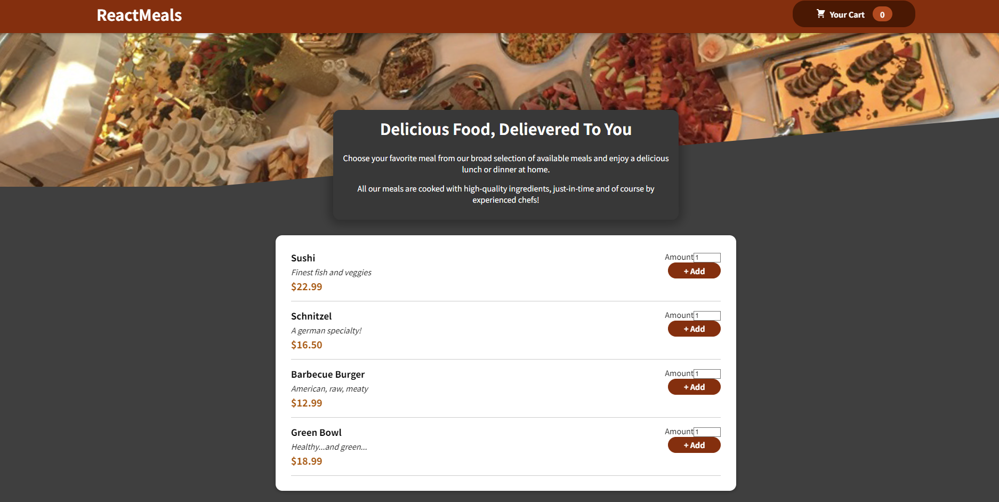
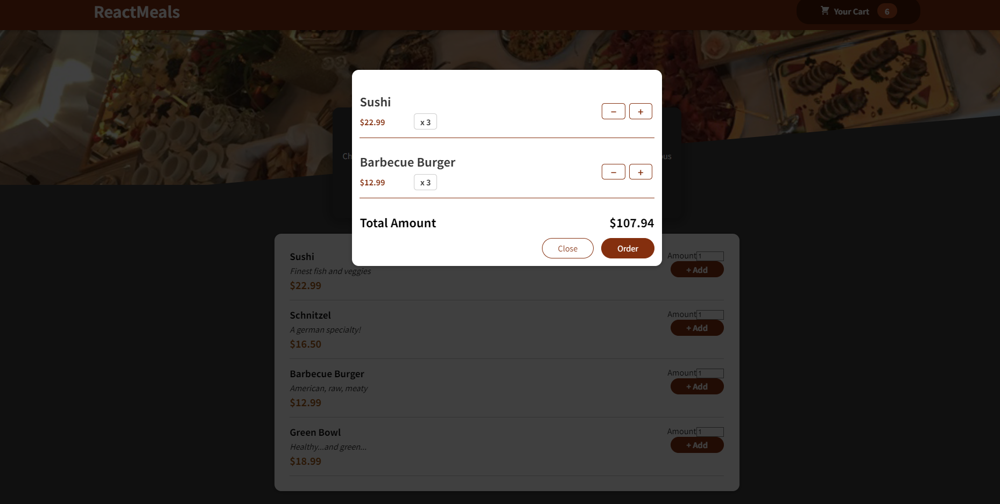

# React Meals

## Description
Welcome to React Meals, a web application that allows you to explore a variety of delicious meals, add them to your cart, and place orders seamlessly. Whether you're a food enthusiast or just looking for a quick and easy way to order meals, React Meals has you covered.

## Deployment
Check out the live deployment of React Meals: [React Meals App](https://omri-react-meals.netlify.app/)

## Features
1. **Add Products to Cart**: Easily add your favorite meals to the shopping cart, including the ability to specify quantities.

2. **View Shopping Cart**: Access your shopping cart to review and manage the selected items.

3. **Order Form**: Complete a form with customer details, including the delivery address.

## Technologies Used
- **React**: Developed using React, the popular JavaScript library for building user interfaces.
- **Firebase**: Integrated Firebase for data management and authentication. [Add specific details about Firebase integration]

## How to Run
To run the project locally, follow these steps:

1. Install dependencies:
```bash
  npm install
````

2. Run app
 ````bach
   npm start
````

3. In your browser: localhost:3000

## Screenshots


_Home Screen_


_Cart_


